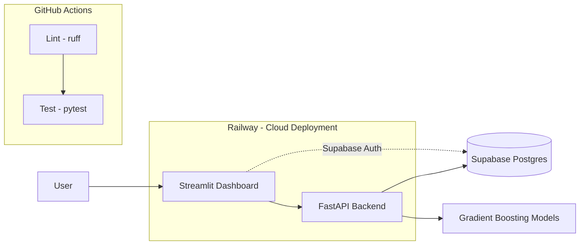

# FunnelIQ

FunnelIQ turns raw marketing and sales data from **Northbound Media**
(`funnel_marketing_data.csv`, ~3,500 records) into a deployed, secure,
production-ready Business Intelligence tool.

The full project spans three infrastructure pillars and six analytical work
packages (see `INSTRUCTIONS.md` for the complete PRD). **This repository is
currently at Pillar 1**: version control, CI automation, and a minimal
FastAPI boilerplate. Database/auth (Supabase) and cloud deployment (Railway)
land in later pillars.

## Architecture (planned)



Only the CI pipeline and the FastAPI scaffold (`/`, `/health`) are live today;
the dashboard, database, auth, and ML models are planned for later pillars.

## Live app

Coming in Pillar 3 (Railway deployment).

## Running locally

```bash
python -m venv .venv
source .venv/bin/activate    # Windows: .venv\Scripts\activate
pip install -r requirements.txt

uvicorn app.main:app --reload
# GET http://127.0.0.1:8000/       -> {"message": "Hello from FunnelIQ"}
# GET http://127.0.0.1:8000/health -> {"status": "ok"}
```

## Development

```bash
ruff check .   # lint
pytest         # tests
```

Both run automatically via GitHub Actions on every push and pull request
(see `.github/workflows/ci.yml`).

## Project roadmap

- **Pillar 1 — Version Control & Automation (GitHub):** this repo, branch/PR
  workflow, `.gitignore`, CI lint + test. ✅ current
- **Pillar 2 — Database & Authentication (Supabase):** relational schema,
  ingestion script, Row Level Security, login flow.
- **Pillar 3 — Cloud Deployment (Railway):** public API + dashboard, CD on
  push, `/health` uptime check.
- **Work Packages 1-6:** EDA, LTV regression, upsell classification,
  super-customer scoring, follow-up funnel analysis, budget optimization
  simulator (see `INSTRUCTIONS.md`).

## Security

Raw data files (`*.csv`), `.env` files, and API keys are excluded via
`.gitignore` and must never be committed.
