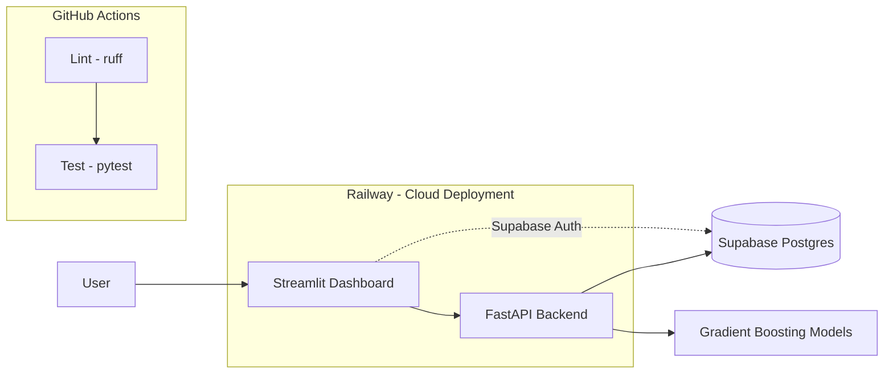

# FunnelIQ

FunnelIQ turns raw marketing and sales data from **Northbound Media**
(`funnel_marketing_data.csv`, ~3,500 records) into a deployed, secure,
production-ready Business Intelligence tool.

The full project spans three infrastructure pillars and six analytical work
packages (see `INSTRUCTIONS.md` for the complete PRD). **This repository
currently has Pillars 1-3 scaffolded**: version control + CI (Pillar 1), a
Supabase schema/RLS/ingestion pipeline and backend JWT verification
(Pillar 2), and Railway deployment config (Pillar 3). The dashboard, login
UI, and the six ML/analytics work packages are not built yet.

## Architecture (planned)



The dashboard and ML models are still planned; everything else in the
diagram (CI, backend, Postgres, auth, Railway) is wired up.

## Live app

Coming once Railway is connected to this repo (see Pillar 3 setup below) —
add the URL here once deployed.

## Pillar 2 setup: Supabase (database & auth)

1. Create a project at [supabase.com](https://supabase.com).
2. Copy `.env.example` to `.env` and fill in the values from
   **Project Settings -> API** (`SUPABASE_URL`, `SUPABASE_ANON_KEY`,
   `SUPABASE_SERVICE_ROLE_KEY`, `SUPABASE_JWT_SECRET`) and
   **Project Settings -> Database -> Connection string -> URI**
   (`DATABASE_URL`). Never commit `.env`.
3. Apply the schema (creates the `funnel_records` table, indexes, and RLS
   policies): open the Supabase SQL Editor and run `schema.sql`, or via CLI:
   ```bash
   psql "$DATABASE_URL" -f schema.sql
   ```
4. Load the dataset (reproducible, no manual UI upload):
   ```bash
   pip install -r requirements.txt
   python ingest_data.py --truncate
   ```
   `--truncate` empties the table first so the script is safely re-runnable.
5. In **Authentication -> Providers**, Email/Password is enabled by default —
   create a test user there (or via the Supabase Auth UI) to obtain a JWT for
   testing the protected API route below.

**Key separation:** only the `anon` key is meant for a frontend/dashboard;
the `service_role` key bypasses Row Level Security and must stay backend-only
(loaded via `app/db.py`, never sent to the browser).

## Running the backend locally

```bash
python -m venv .venv
source .venv/bin/activate    # Windows: .venv\Scripts\activate
pip install -r requirements.txt

uvicorn app.main:app --reload
# GET  http://127.0.0.1:8000/         -> {"message": "Hello from FunnelIQ"}
# GET  http://127.0.0.1:8000/health   -> {"status": "ok"}
# GET  http://127.0.0.1:8000/api/me         -> requires Authorization: Bearer <supabase-jwt>
# POST http://127.0.0.1:8000/api/score-lead  -> requires Authorization: Bearer <supabase-jwt>
```

`/api/me` verifies the Supabase-issued JWT (HS256, signed with
`SUPABASE_JWT_SECRET`) and returns the decoded user id/email — a template for
further protected routes. `/api/score-lead` returns a 0-100 "Super-Customer"
likelihood score (Work Package 4) using the model committed at
`models/super_customer_score.cbm`.

## Running the dashboard locally

```bash
streamlit run dashboard/app.py
```

Run from the repo root with the same venv as above. Currently shows the
Work Package 5 follow-up funnel chart; reads `funnel_marketing_data.csv`
directly (same placeholder data source as the `analysis/` scripts) - the
Supabase-backed read path and login UI are still open Pillar 2 items, so
this local dashboard isn't yet what a deployed instance would show.

## Pillar 3 setup: Railway (cloud deployment)

1. On [railway.app](https://railway.app), create a new project ->
   **Deploy from GitHub repo** -> select `levonaai/funneliq` -> pick `main`
   as the deploy branch (merge the open PRs into `main` first).
2. Railway auto-detects the Python app via `requirements.txt` and uses the
   `Procfile` (`web: uvicorn app.main:app --host 0.0.0.0 --port $PORT`) as the
   start command. No Dockerfile needed.
3. In the service's **Variables** tab, set every key from `.env.example`
   (`SUPABASE_URL`, `SUPABASE_ANON_KEY`, `SUPABASE_SERVICE_ROLE_KEY`,
   `SUPABASE_JWT_SECRET`, `DATABASE_URL`) as environment variables — never
   commit real values to the repo. `PORT` is injected automatically; don't
   set it manually.
4. Under **Settings -> Networking**, click **Generate Domain** to get a
   public `*.up.railway.app` URL (services aren't publicly reachable until
   you do this).
5. Under **Settings -> Source**, confirm **Auto Deploy** is on for the
   branch you picked in step 1 — every push to it now triggers a redeploy.
6. Verify it's live: `curl https://<your-app>.up.railway.app/health` should
   return `{"status": "ok"}`.
7. Verify it survives a restart: in the Railway dashboard, use the service's
   **Restart** action (or trigger a redeploy), then re-run the same `curl`
   against `/health` once it's back up — it should return the same
   `{"status": "ok"}` with no manual intervention.
8. Update the **Live app** link above with the generated URL.

## Development

```bash
ruff check .   # lint
pytest         # tests
```

Both run automatically via GitHub Actions on every push and pull request
(see `.github/workflows/ci.yml`).

## Project roadmap

- **Pillar 1 — Version Control & Automation (GitHub):** this repo, branch/PR
  workflow, `.gitignore`, CI lint + test. ✅
- **Pillar 2 — Database & Authentication (Supabase):** schema, RLS,
  ingestion script, backend JWT verification. ✅ scaffolded — needs a live
  Supabase project + a frontend login UI (tracked with the dashboard work).
- **Pillar 3 — Cloud Deployment (Railway):** `Procfile`, env var contract,
  `/health` endpoint. ✅ scaffolded — needs the Railway project connected.
- **Work Package 1 — EDA & Data Cleaning:** ✅ see
  [`docs/eda_findings.md`](docs/eda_findings.md) (generated by
  `python -m analysis.eda`); cleaning rules live in
  `analysis/data_cleaning.py`.
- **Work Package 2 — LTV Regression:** ✅ see
  [`docs/ltv_regression_findings.md`](docs/ltv_regression_findings.md)
  (generated by `python -m analysis.ltv_regression`); XGBoost, LightGBM,
  CatBoost compared with 5-fold CV, `cumulative_profit` excluded from
  features to avoid data leakage.
- **Work Package 3 — Upsell Classification:** ✅ see
  [`docs/upsell_classification_findings.md`](docs/upsell_classification_findings.md)
  (generated by `python -m analysis.upsell_classification`); stratified
  5-fold CV, class-imbalance handling, compared against a majority-class
  baseline and a business-rule heuristic.
- **Work Package 4 — Super-Customer Score:** ✅ see
  [`docs/super_customer_score_findings.md`](docs/super_customer_score_findings.md)
  (generated by `python -m analysis.super_customer_score`); CatBoost with
  native categorical handling for a `budget_tier` feature, hyperparameter
  grid search, trained model committed at
  `models/super_customer_score.cbm` and served via the protected
  `POST /api/score-lead` endpoint (`app/scoring.py`).
- **Work Package 5 — Follow-Up Funnel Analysis:** ✅ see
  [`docs/followup_funnel_findings.md`](docs/followup_funnel_findings.md)
  (generated by `python -m analysis.followup_funnel`); anomalous drop-off
  identified at `followup_4` -> `followup_5`, plus a visual funnel chart in
  the new Streamlit dashboard (`dashboard/app.py`).
- **Work Package 6:** budget optimization simulator (see `INSTRUCTIONS.md`).

## Security

Raw data files (`*.csv`), `.env` files, and API keys are excluded via
`.gitignore` and must never be committed. `.env.example` documents the
required variable names without real values. The backend never exposes the
`service_role` key; only the `anon` key is safe to ship to a frontend.
