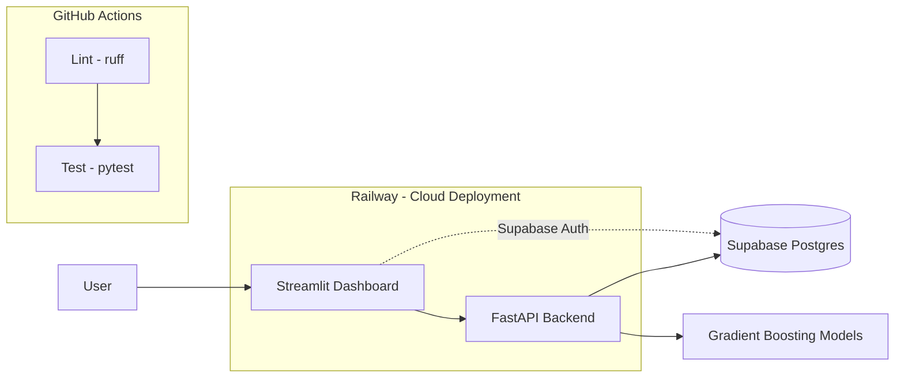

# FunnelIQ

FunnelIQ turns raw marketing and sales data from **Northbound Media**
(`funnel_marketing_data.csv`, ~3,500 records) into a deployed, secure,
production-ready Business Intelligence tool.

The full project spans three infrastructure pillars and six analytical work
packages (see `INSTRUCTIONS.md` for the complete PRD, and
[`REPORT.md`](REPORT.md) for the consolidated analytical findings). All
six work packages are implemented, and all three infrastructure pillars
are fully live: schema + RLS + real ingested data + working Supabase Auth
login (Pillar 2), deployed and verified end-to-end on Railway (Pillar 3).

## Architecture



Everything in this diagram is implemented and locally verified end-to-end
(dashboard, backend, Postgres, auth, models); only the Railway deployment
itself is still a manual setup step (see Pillar 3 below).

## Live app

**API**: https://funneliq-production-9c1b.up.railway.app
([`/health`](https://funneliq-production-9c1b.up.railway.app/health),
`/api/me`, `/api/score-lead` - JWT-protected). Deployed on Railway,
auto-deploys on every push to `main`.

## Pillar 2 setup: Supabase (database & auth)

1. Create a project at [supabase.com](https://supabase.com).
2. Copy `.env.example` to `.env` and fill in the values from
   **Project Settings -> API** (`SUPABASE_URL`, `SUPABASE_ANON_KEY`,
   `SUPABASE_SERVICE_ROLE_KEY`) and **Project Settings -> Database ->
   Connection string -> URI** (`DATABASE_URL`). Never commit `.env`.
3. Apply the schema (creates the `funnel_records` table, indexes, and RLS
   policies) - no `psql` needed:
   ```bash
   pip install -r requirements.txt
   python -c "
   from dotenv import load_dotenv; load_dotenv()
   import os
   from sqlalchemy import create_engine, text
   engine = create_engine(os.environ['DATABASE_URL'])
   with engine.begin() as conn:
       conn.execute(text(open('schema.sql', encoding='utf-8').read()))
   print('schema applied')
   "
   ```
   (or paste `schema.sql` into the Supabase SQL Editor if you prefer).
4. Load the dataset (reproducible, no manual UI upload):
   ```bash
   python ingest_data.py --truncate
   ```
   `--truncate` empties the table first so the script is safely re-runnable.
5. In **Authentication -> Providers**, Email/Password is enabled by
   default. The dashboard's sign-up tab (see below) creates accounts
   directly - no manual user creation needed.

**Key separation:** only the `anon` key is meant for a frontend/dashboard;
the `service_role` key bypasses Row Level Security and must stay backend-only
(loaded via `app/db.py`, never sent to the browser).

## Running the backend locally

```bash
python -m venv .venv
source .venv/bin/activate    # Windows: .venv\Scripts\activate
pip install -r requirements.txt

uvicorn app.main:app --reload
# GET  http://127.0.0.1:8000/         -> {"message": "Hello from FunnelIQ"}
# GET  http://127.0.0.1:8000/health   -> {"status": "ok"}
# GET  http://127.0.0.1:8000/api/me         -> requires Authorization: Bearer <supabase-jwt>
# POST http://127.0.0.1:8000/api/score-lead  -> requires Authorization: Bearer <supabase-jwt>
```

`/api/me` verifies the Supabase-issued JWT against Supabase's public JWKS
endpoint (asymmetric ES256/RS256 - current Supabase projects no longer use
a shared HS256 secret, see `app/auth.py`) and returns the decoded user
id/email — a template for further protected routes. `/api/score-lead`
returns a 0-100 "Super-Customer" likelihood score (Work Package 4) using
the model committed at `models/super_customer_score.cbm`.

## Running the dashboard locally

```bash
streamlit run dashboard/app.py
```

Run from the repo root with the same venv as above. Gated behind Supabase
email/password sign-in (`dashboard/auth.py`, anon key only) - sign up with
any email/password on first visit. Two pages once signed in: the Work
Package 5 follow-up funnel chart, and the Work Package 6 budget
optimization simulator. Both still read `funnel_marketing_data.csv`
directly rather than the live `funnel_records` table (same placeholder
data source as the `analysis/` scripts) - swapping that read path for a
Supabase query is the one remaining Pillar 2 item.

## Pillar 3 setup: Railway (cloud deployment)

1. On [railway.app](https://railway.app), create a new project ->
   **Deploy from GitHub repo** -> select `levonaai/funneliq` -> pick `main`
   as the deploy branch (merge the open PRs into `main` first).
2. Railway auto-detects the Python app via `requirements.txt` and uses the
   `Procfile` (`web: uvicorn app.main:app --host 0.0.0.0 --port $PORT`) as the
   start command. No Dockerfile needed.
3. In the service's **Variables** tab, set every key from `.env.example`
   (`SUPABASE_URL`, `SUPABASE_ANON_KEY`, `SUPABASE_SERVICE_ROLE_KEY`,
   `DATABASE_URL`) as environment variables — never commit real values to
   the repo. `PORT` is injected automatically; don't set it manually.
4. Under **Settings -> Networking**, click **Generate Domain** to get a
   public `*.up.railway.app` URL (services aren't publicly reachable until
   you do this).
5. Under **Settings -> Source**, confirm **Auto Deploy** is on for the
   branch you picked in step 1 — every push to it now triggers a redeploy.
6. Verify it's live: `curl https://<your-app>.up.railway.app/health` should
   return `{"status": "ok"}`.
7. Verify it survives a restart: in the Railway dashboard, use the service's
   **Restart** action (or trigger a redeploy), then re-run the same `curl`
   against `/health` once it's back up — it should return the same
   `{"status": "ok"}` with no manual intervention.
8. Update the **Live app** link above with the generated URL.

## Development

```bash
ruff check .   # lint
pytest         # tests
```

Both run automatically via GitHub Actions on every push and pull request
(see `.github/workflows/ci.yml`).

## Project roadmap

- **Pillar 1 — Version Control & Automation (GitHub):** this repo, branch/PR
  workflow, `.gitignore`, CI lint + test. ✅
- **Pillar 2 — Database & Authentication (Supabase):** ✅ live - schema +
  RLS applied to a real project, 3,500 rows ingested and verified,
  anon-key access confirmed blocked, backend JWT verification against
  Supabase's JWKS, dashboard login screen (email/password, `dashboard/auth.py`).
- **Pillar 3 — Cloud Deployment (Railway):** ✅ live - connected to `main`
  for auto-deploy, `/health` verified, and the protected `/api/me` /
  `/api/score-lead` routes confirmed working end-to-end against the real
  Supabase project in production.
- **Work Package 1 — EDA & Data Cleaning:** ✅ see
  [`docs/eda_findings.md`](docs/eda_findings.md) (generated by
  `python -m analysis.eda`); cleaning rules live in
  `analysis/data_cleaning.py`.
- **Work Package 2 — LTV Regression:** ✅ see
  [`docs/ltv_regression_findings.md`](docs/ltv_regression_findings.md)
  (generated by `python -m analysis.ltv_regression`); XGBoost, LightGBM,
  CatBoost compared with 5-fold CV, `cumulative_profit` excluded from
  features to avoid data leakage.
- **Work Package 3 — Upsell Classification:** ✅ see
  [`docs/upsell_classification_findings.md`](docs/upsell_classification_findings.md)
  (generated by `python -m analysis.upsell_classification`); stratified
  5-fold CV, class-imbalance handling, compared against a majority-class
  baseline and a business-rule heuristic.
- **Work Package 4 — Super-Customer Score:** ✅ see
  [`docs/super_customer_score_findings.md`](docs/super_customer_score_findings.md)
  (generated by `python -m analysis.super_customer_score`); CatBoost with
  native categorical handling for a `budget_tier` feature, hyperparameter
  grid search, trained model committed at
  `models/super_customer_score.cbm` and served via the protected
  `POST /api/score-lead` endpoint (`app/scoring.py`).
- **Work Package 5 — Follow-Up Funnel Analysis:** ✅ see
  [`docs/followup_funnel_findings.md`](docs/followup_funnel_findings.md)
  (generated by `python -m analysis.followup_funnel`); anomalous drop-off
  identified at `followup_4` -> `followup_5`, plus a visual funnel chart in
  the new Streamlit dashboard (`dashboard/app.py`).
- **Work Package 6 — Budget Optimization Simulator:** ✅ see
  [`docs/budget_optimizer_findings.md`](docs/budget_optimizer_findings.md)
  (generated by `python -m analysis.budget_optimizer`); profit peaks
  sharply for campaigns budgeted 2,000-5,000 (not a smooth curve), so
  neither full concentration nor full spread of a 50,000 budget is
  optimal - the best split found is 25 campaigns of 2,000 each. Interactive
  version in the dashboard (`dashboard/pages/2_Budget_Simulator.py`).

All six analytical work packages are now implemented (see `INSTRUCTIONS.md`
Part C for the full deliverables checklist).

## Security

Raw data files (`*.csv`), `.env` files, and API keys are excluded via
`.gitignore` and must never be committed. `.env.example` documents the
required variable names without real values. The backend never exposes the
`service_role` key; only the `anon` key is safe to ship to a frontend.
